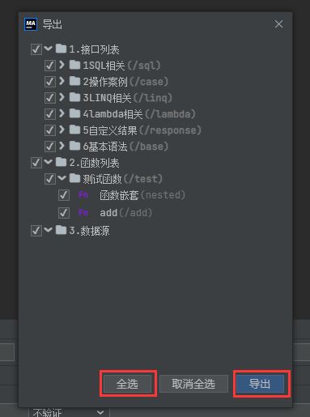
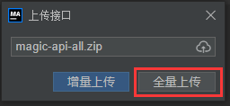

### 准备工作

由于`2.x`重构了底层存储逻辑，`1.x`并不能直接升级至`2.x`版本，需要对存储结构做调整。

首先不要升级，启动项目后，在页面中，把所有接口、函数、数据源导出。


### 升级版本

将`pom.xml`中`magic-api`的版本号改为`magic-api-lastest-version`，随后重新启动项目

::: tip
由于`2.x`后台大量重构，所以有可能启动不起来，需要对代码进行调整。请看后续的非兼容变更
:::

### 修改配置

为了防止升级失败，先建立一张与`magic_api_file`一样的表，起名为`magic_api_file_v2`
```yml
magic-api:
  resource:
    type: database
    table-name: magic_api_file_v2
    prefix: /magic-api
```

::: tip
如果使用其它存储方式的，建议将原来的数据进行备份。
:::

### 导入旧版数据

启动成功后，在页面中将导出的`zip`压缩包全量上传



至此，版本升级完毕。

### 非兼容的变更

#### 配置项变更

- `magic-api.response-code-config` 变更为 `magic-api.response-code`
- `magic-api.backup-config` 变更为 `magic-api.backup`
- 移除`magic-api.backup-config.resource-type`配置，现在只能存数据库，不再支持选择
- 新增`magic-api.backup.enable`配置，意为是否启用配置，默认为`false`
- `magic-api.crud-config` 变更为 `magic-api.crud`
- `magic-api.cache-config` 变更为 `magic-api.cache`
- `magic-api.page-config` 变更为 `magic-api.page`
- `magic-api.security-config` 变更为 `magic-api.security`
- `magic-api.swagger-config` 变更为 `magic-api.swagger`
- `magic-api.debug-config` 变更为 `magic-api.debug`
- `magic-api.cluster-config.instance-id` 变更为 `magic-api.instance-id`
- 移除`magic-api.cluster-config`配置，改为插件实现

#### API变更

- 集群、Redis、Mongo相关功能已改为插件实现。
- 模块定义从实现`MagicModule`接口改为`@MagicModule`注解实现 详情请看 [自定义模块](/pages/senior/module)
- `MagicAPIService`移除存储相关`API`，改为`MagicResourceService`实现

#### 其它变更

- 前端目前不支持`Vue`方式直接引入，请改用 [iframe方式](/pages/security/login/#iframe方式) 引入