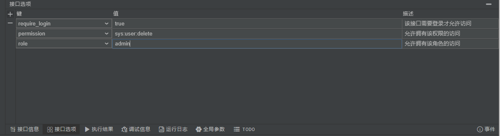

## 鉴权流程

- 需要让自身框架对`magic-api`生成出来的接口给与放行，交给自己写的拦截器来实现。
- 在页面上配置接口选项
- 编写拦截器来实现接口鉴权


## 配置接口选项



## 配置权限校验

```java
/**
 * magic-api 接口鉴权
 */
@Component
public class CustomRequestInterceptor implements RequestInterceptor {

	private static final Logger logger = LoggerFactory.getLogger(CustomRequestInterceptor.class);

	/**
	 * 接口请求之前
	 * @param info	接口信息
	 * @param context	脚本变量信息
	 */
	@Override
	public Object preHandle(ApiInfo info, MagicScriptContext context, MagicHttpServletRequest request, MagicHttpServletResponse response) throws Exception {
		User user = null; // = XXXUtils.getUser(request);
		logger.info("{} 请求接口：{}", user, info.getName());
		// 接口选项配置了需要登录
		if ("true".equals(info.getOptionValue(Options.REQUIRE_LOGIN))) {
			if (user == null) {
				return new JsonBean<>(401, "用户未登录");
			}
		}
		String role = info.getOptionValue(Options.ROLE);
		if (StringUtils.isNotBlank(role) && user.hasRole(role)) {
			return new JsonBean<>(403, "用户权限不足");
		}
		String permission = info.getOptionValue(Options.PERMISSION);
		if (StringUtils.isNotBlank(permission) && user.hasPermission(permission)) {
			return new JsonBean<>(403, "用户权限不足");
		}
		return null;
	}

	/**
	 * 接口执行之后
	 * @param info	接口信息
	 * @param context	变量信息
	 * @param value 即将要返回到页面的值
	 */
	@Override
	public Object postHandle(ApiInfo info, MagicScriptContext context, Object value, MagicHttpServletRequest request, MagicHttpServletResponse response) throws Exception {
		logger.info("{} 执行完毕，返回结果:{}", info.getName(), value);
		return null;
	}
}
```

## 让自身框架对`magic-api`生成出的接口放行

:::tip 提示
下方代码是以`Spring Security`为例，对`magic-api`生成出的接口放行示例，其他框架自行想办法处理。
:::


```java
import org.springframework.security.access.AccessDeniedException;
import org.springframework.security.access.ConfigAttribute;
import org.springframework.security.authentication.InsufficientAuthenticationException;
import org.springframework.security.core.Authentication;
import org.springframework.security.web.FilterInvocation;
import org.springframework.web.method.HandlerMethod;
import org.springframework.web.servlet.mvc.method.annotation.RequestMappingHandlerMapping;
import org.ssssssss.magicapi.core.web.RequestHandler;
import org.apache.commons.lang3.StringUtils;

import javax.servlet.http.HttpServletRequest;
import java.util.Collection;
public class MagicAPIAccessDecisionManager implements org.springframework.security.access.AccessDecisionManager {

    private final RequestMappingHandlerMapping requestMappingHandlerMapping;

    public PdAccessDecisionManager(RequestMappingHandlerMapping requestMappingHandlerMapping) {
        this.requestMappingHandlerMapping = requestMappingHandlerMapping;
    }

    @Override
    public void decide(Authentication authentication, Object object,
                       Collection<ConfigAttribute> configAttributes)
            throws AccessDeniedException, InsufficientAuthenticationException {

        FilterInvocation invocation = (FilterInvocation) object;
        HttpServletRequest request = invocation.getHttpRequest();
        Object handler = null;
        try {
            handler = requestMappingHandlerMapping.getHandler(request).getHandler();
        } catch (Exception ignored) {
        }
        if(handler != null && handler instanceof HandlerMethod) {
            HandlerMethod handlerMethod = (HandlerMethod) handler;
            // 提取处理类，判断是否是`magic-api`的处理器
            if(RequestHandler.class == handlerMethod.getBean().getClass()){
                return;
            }
        }
        String token = request.getHeader("token");
        if (StringUtils.isNotBlank(token)) {
            return;
        }
        if(configAttributes.stream()
                .map(Object::toString)
                .anyMatch(it -> it.equals("permitAll") || it.equals("anonymous"))){
            return;
        }
        throw new AccessDeniedException("Access is denied.");
    }
    @Override
    public boolean supports(ConfigAttribute attribute) {
        return true;
    }

    @Override
    public boolean supports(Class<?> clazz) {
        return true;
    }
}
```

```java
@Autowired
RequestMappingHandlerMapping requestMappingHandlerMapping;

@Override
protected void configure(HttpSecurity httpSecurity) throws Exception{
	// 其它配置省略...自行视情况配置。
    httpSecurity.authorizeRequests()
        .accessDecisionManager(new MagicAPIAccessDecisionManager(requestMappingHandlerMapping))
}
```
