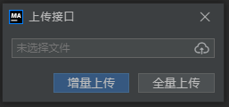
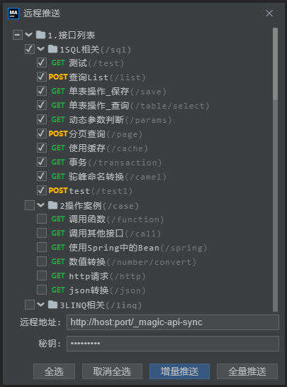

# 接口发布


## 导出&上传

在**本地环境**中，写好接口后，可以通过导出，在到**生产环境**中通过上传的方式进行部署




- **增量上传** 此模式上传仅仅针对上传的资源中进行更新，不会对接口进行删除操作。
- **全量上传** 此模式以上传内容为基准，全量覆盖更新，如果没有必要不建议进行此操作。

此方法对于除只读模式外的所有方式配置均有效。

## 使用文件

此方法适合配置文件中配置方式是如下形式的：

```yml
magic-api:
  resource:
    type: file # 此项默认值是file，可省略
    location: /xx/xx/xx/magic-api # 配置文件存储路径
```
此时需要把本地资源上传到该目录下，然后在到UI界面上点击整个页面右上角的**刷新**按钮。

另外也可以通过上传、推送的方式进行部署

## 使用Jar

对于将接口信息存到`jar`内的，部署需要将写好的接口信息打包至`jar`内，重新部署即可

```yml
magic-api:
  resource:
    location: classpath: magic-api # 接口信息存放在 src/main/resources/magic-api 下
```

## 使用数据库
需要将写好的接口信息，**自行同步**到数据库中，同步后，点击页面上右上角的**刷新**按钮即可

另外也可以通过上传、推送的方式进行部署

## 使用Redis

需要将写好的接口信息，**自行同步**到`Redis`中，同步后，点击页面上右上角的**刷新**按钮即可

另外也可以通过上传、推送的方式进行部署


## 接口推送
### 前置条件
- 推送的目标开启了推送配置
- 推送的目标不是只读模式
- 从本地能连通至目标服务



## 本地和远程使用同一个存储
### 前置条件
- 本地和远程使用一个数据库或`Redis`或同一个存储位置
- 远程开启了`UI`界面
### 更新方式

由于`magic-api`启动之后，会将接口信息缓存至内存中，所以数据库发生改变后，对于应用是无感知的，需要重新读取，此时点击页面右上角的**刷新**按钮即可

另外对于这种方式是不推荐的，因为本地修改后可能会影响到正式接口
