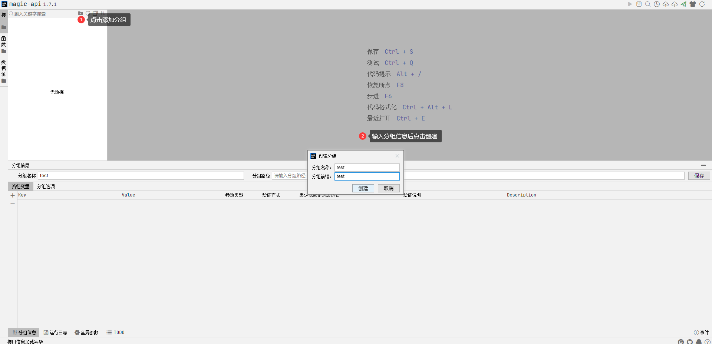
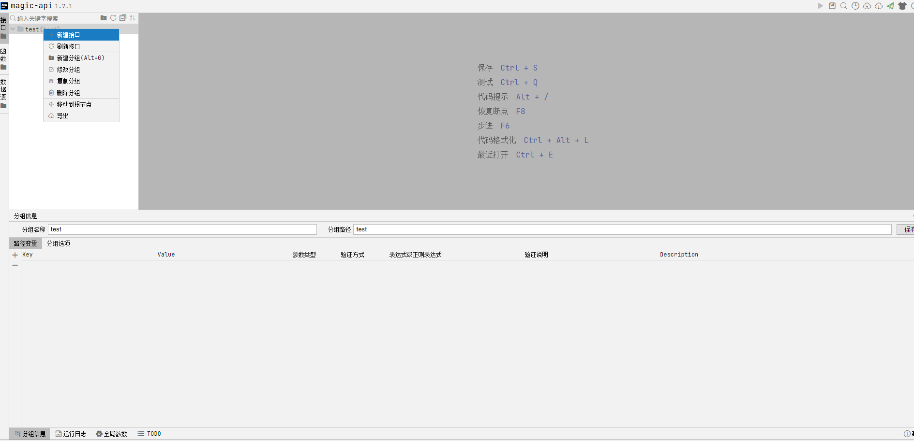
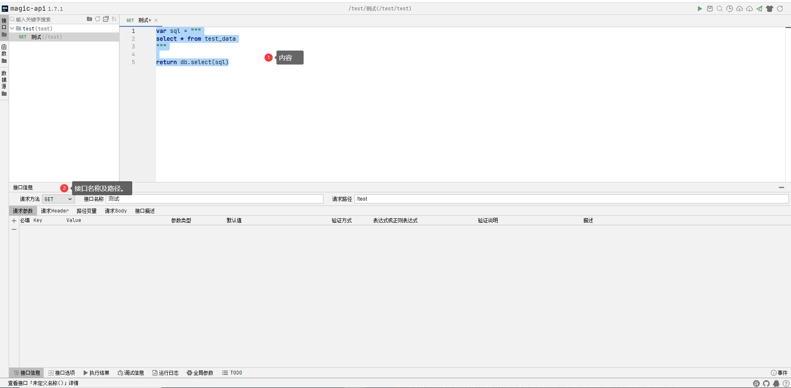

# 快速开始

​	我们将通过一个简单的demo来阐述magic-api的功能。假设您已经：

* 拥有Java开发环境及相关IDE。
* 拥有Mysql环境。
* 熟悉Spring Boot。
* 熟悉Maven。


​	创建一张测试表`TestData`,结构如下

| id   | name     |
| ---- | -------- |
| 1    | magicApi |
| 2    | xiaoDong |

​	DDL如下：

```sql
create table test_data
(
    id   bigint       not null
        primary key,
    name varchar(100) null
);
INSERT INTO test_data (id, name) VALUES (1, 'magicApi');
INSERT INTO test_data (id, name) VALUES (2, 'xiaoDong');
```

## 初始化工程

​	创建一个空的 Spring Boot 工程, 以mysql作为默认数据库进行演示。

## 添加依赖

引入 Spring Boot Starter 父工程：

```xml
<parent>
    <groupId>org.springframework.boot</groupId>
    <artifactId>spring-boot-starter-parent</artifactId>
    <version>spring-latest-version</version>
    <relativePath/>
</parent>
```

​	引入`magic-api-spring-boot-starter`依赖。

```xml
<dependency>
    <groupId>org.ssssssss</groupId>
    <artifactId>magic-api-spring-boot-starter</artifactId>
    <version>1.7.1</version>
</dependency>
```

​	引入`spring-boot-starter`,`spring-boot-starter-web`, `spring-boot-starter-test`, `mysql`依赖。

```xml
<dependency>
    <groupId>org.springframework.boot</groupId>
    <artifactId>spring-boot-starter</artifactId>
</dependency>
<dependency>
    <groupId>org.springframework.boot</groupId>
    <artifactId>spring-boot-starter-web</artifactId>
</dependency>
<dependency>
    <groupId>org.springframework.boot</groupId>
    <artifactId>spring-boot-starter-test</artifactId>
    <scope>test</scope>
</dependency>
<dependency>
    <groupId>org.springframework.boot</groupId>
    <artifactId>spring-boot-starter-jdbc</artifactId>
</dependency>
<dependency>
    <groupId>mysql</groupId>
    <artifactId>mysql-connector-java</artifactId>
    <version>8.0.27</version>
</dependency>
```

## 配置

​	application.yml

```properties
server:
  port: 9999
magic-api:
  #配置web页面入口
  web: /magic/web
  resource:
  	#配置文件存储位置。当以classpath开头时，为只读模式
    location: F:/data/magic-api

spring:
  datasource:
    driver-class-name: com.mysql.jdbc.Driver
    url: jdbc:mysql://localhost:3306/magic-api-test?allowMultiQueries=true&useUnicode=true&characterEncoding=UTF-8
    username: root
    password: test
```
## 访问api管理界面

启动项目之后，访问`http://localhost:9999/magic/web` 即可看到Web页面

## 三分钟写出查询接口

**1. 创建分组**

  点击创建分组按钮后，输入分组信息，点击创建。



**2. 新建接口**

  右键分组，点击新建接口。



  在编辑器输入内容后，填写接口名称和及其路径。

```js
var sql = """
select * from test_data
"""

return db.select(sql)
```



​	ctrl+s保存后，即可访问接口。

**3.访问接口**

```cmd
> curl http://localhost:9999/test/test

{
    "code": 1,
    "message": "success",
    "data": [
        {
            "id": 1,
            "name": "magicApi"
        },
        {
            "id": 2,
            "name": "xiaoDong"
        }
    ],
    "timestamp": 1638192442535,
    "executeTime": 9
}
```

​	也可以通过web界面执行。


## 小结

​	通过以上几个步骤，我们就实现了一个简单的查询功能。省去了`Controller`、`Service`、`Dao`、`Mapper`、`XML`、`VO`等模板代码的工作量。

​	想要了解更多`magic-api`的功能？请接着往下看。

