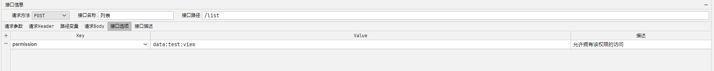
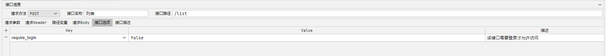

## 权限标识配置

接口选项里面配置`permission`

## 登录权限配置

默认都是需要登录鉴权的，接口选项里面配置`require_login=false`表示该接口不需要登录鉴权

## 数据权限自定义
* sql方式
```javascript
import '@/permission/office' as permissionOffice;
var userIds = permissionOffice()

return db.page("""
    select id,name from sys_test_data where 1 = 1 
    ?{userIds, and create_by in (#{userIds})}
""")
```
* 单表api方式
```javascript
import '@/permission/office' as permissionOffice;
var userIds = permissionOffice()

return db.table("sys_test_data").where().in("create_by",userIds).page()
```
