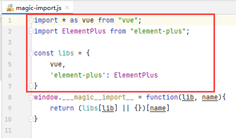
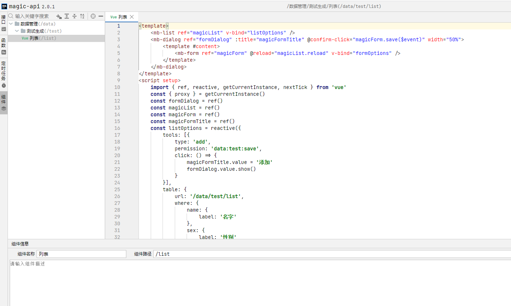
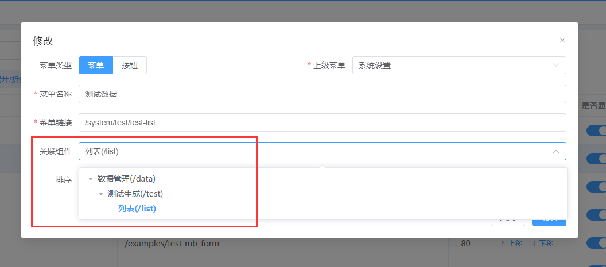

## 简介
利用Vue3的@vue/compiler-sfc单文件编译，动态编译组件，可以实现在浏览器编写Vue代码，既改即生效快速开发。  
组件为全局注册，在其他组件中也可以引用。

## import包维护
  
magic-api插件“组件”内可以import的所有包，在magic-import.js中维护

## 使用方法

左侧“组件”插件内，添加组、组件并配置名称和路径  
全局注册名称为“组路径”+“组件路径”用“-”隔开，如：`<data-test-list />`  

然后和菜单关联即可
